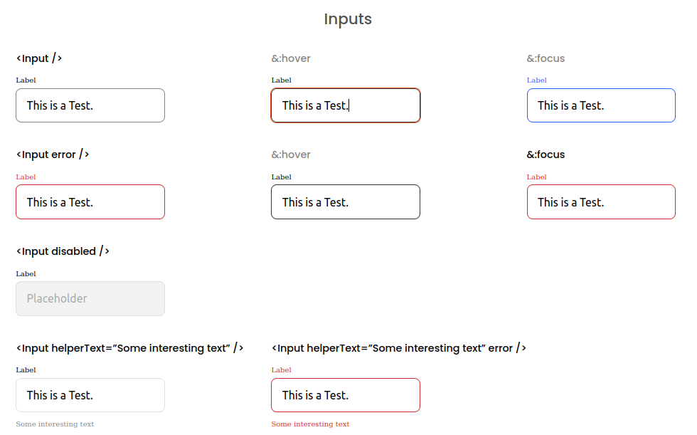

# Inputs Component.
This single page app was build with the idea of making a input component that could be recicled and managed from an API data (using a mock api in this version). 

## Built With
- HTML
- CSS
- Javascript
- ReactJs

## Live Demo



[Live Version](https://inputmasterreact.netlify.app/)

## Getting Started

To get a local copy up and running follow these simple example steps.

### Setup

- Clone this repository. Type `git clone https://github.com/SigmaSam/input-master.git`
- Navigate to the project folder (button-component-master) `cd input-master`
- run `npm install` to get all packages needed for the app then run `npm run build`.
- Open your localhost:3000 or wait for React to open it for you if you want to see the app running.

### Run tests

```
npx eslint .
```
## Authors

Feel free to reach out. We are always happy to connect :slightly_smiling_face:

👤 **Samuel Almao**

[<code></code>](https://github.com/SigmaSam)[<code></code>](https://twitter.com/DungeonSam)[<code></code>](https://www.linkedin.com/in/samuel-almao/)

## 🤝 Contributing

Contributions, issues and feature requests are welcome!

Feel free to check the <a href="https://github.com/SigmaSam/input-master/issues"> issues page</a>.

## Show your support

Give a ⭐️ if you like this project!
